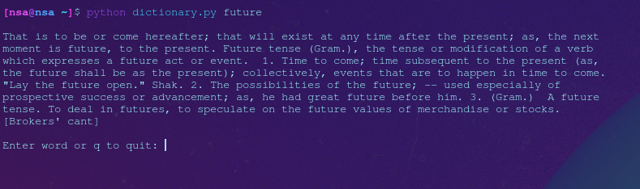
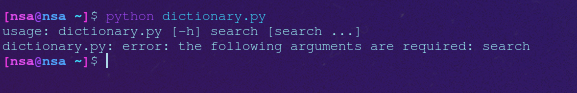

# Merriam Webster Command Line Dictionary
Search through the entire Merriam Webster Dictionary in your terminal.

## Install
Download and store python script and JSON file in same directory. (Or set custom path in script)

## Usage
Run the script with 

```
python dictionary.py future
```

Or set it to a custom alias in your aliasrc file.

## Help

```
python dictionary.py --help
```

## Preview


